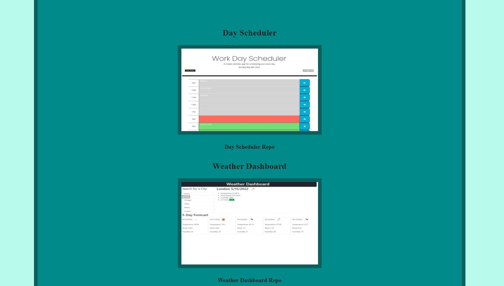

# <a href="https://mbenson025.github.io/portfolio-mason/">Link to Portfolio</a>

<br>

# About

A compilation of professional skills and work sample references from applications deployed on github. This portfolio is designed to showcase my developing skills as a programmer

<br>

<br>

## Table of Contents

- [Usage](#usage) -[Screenshots](#screenshots) -[Credits](#credits) -[License](#license)

<br></br>

## Usage

- This website has an about me, work portfolio and a contact section with a downloadable resume
  - A brief explanation of my professional experience in the About Me section.
  - Users can see my works on Portfolio page accompanied with pictures.
  - Contact information and links in the Contact me section.

<br>

## Screenshots

Screenshots:





<br><br/>

## Credits

Cecy- media queries

https://flexboxfroggy.com/ - everything else

## License

MIT License

Copyright (c) 2022 Mason Benson

Licensed under the [MIT](LICENSE) license.

```

```
